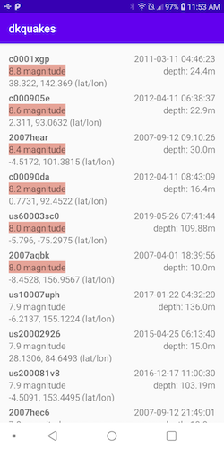
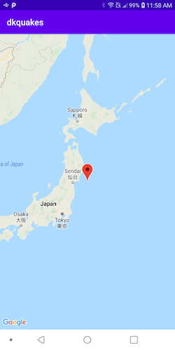

## DKQuakes: Earthquakes Data Feed Example Android App

An example project that demonstrates use of the latest Android Development **Best Practices**
for UI & Navigation (**JetPack**), MVVM (**View/DataBinding**), asynchronous tasks (**Kotlin Coroutines**), Unit Tests & Integration/Functional Testing (**Mocking**; custom **Test Runners**), etc.

----

### Features & Architectural Considerations

 - Leverages approaches from Google's latest **Android Architecture Blueprints** per [https://github.com/android/architecture-samples](https://github.com/android/architecture-samples)
 - A single-activity UI architecture, using the **Navigation Component** to manage fragment operations; see [https://developer.android.com/guide/navigation/navigation-getting-started](https://developer.android.com/guide/navigation/navigation-getting-started).
 - A **Presentation Layer** using a `ViewModel` per screen or feature; see [https://developer.android.com/topic/libraries/architecture/viewmodel](https://developer.android.com/topic/libraries/architecture/viewmodel)
 - "Reactive" UI design using `LiveData` observables and **Data Binding**; i.e. changes to underlying data propagate via observation, so are updated only when necessary.
 - An abstracted **Repository/Service Interface** that can provide either a **mocked** or real implementation for the web-service / data-source layer. Annotated using *Retrofit* but can easily accommodate any network service-layer implementation.
 - Note that the service layer leverages **Kotlin Coroutines** (i.e. `suspend functions; launched in viewModelScope) per [https://developer.android.com/topic/libraries/architecture/coroutines](https://developer.android.com/topic/libraries/architecture/coroutines)
 - Ideally, entity objects and DTOs are correctly distinct per proper **Separation of Concerns** and **CLEAN** architecture principles; see [https://blog.cleancoder.com/uncle-bob/2012/08/13/the-clean-architecture.html](https://blog.cleancoder.com/uncle-bob/2012/08/13/the-clean-architecture.html).

### Notes and TODOs/FIXMEs

 -  Per the "Single Activity" architecture, it actually proved easier to host the Google Map used for the Earthquake Detail page as a *separate activity* for now (using the `SupportMapFragment`) -- though a custom detail *fragment* (containing a `MapView`) could have been used instead. An earlier [commit](https://github.com/sfjava/dkquakes/commit/430423cf4f8865ea4ee7ae58001817aaf07ac6ac), in fact, shows using an `EarthquakeDetailFragment`, but I had difficultly getting the `MapView` approach to render correctly, even when using snippets per their [docs and sample project](https://developers.google.com/maps/documentation/android-sdk/map).
 -  Clean **separation of DTOs** from the view-model (entity) layer proved difficult to achieve, in practice, since the Android `RecyclerView` doesn't lend itself readily to view-model backing for each list-item row; and there are some "lifecycle owner" subtleties to be aware of, e.g. see: [https://stackoverflow.com/a/61455905](https://stackoverflow.com/a/61455905)
 - Even though the specifications for this project supplied a "hard-coded" query for only a **single page** of Earthquakes data from the *geonames.org* web-service, a logical "next step" would be to annotate the appropriate **query-and-path parameters** for this endpoint; and to leverage the latest **Paging Library**, which provides "powerful capabilities for loading and displaying paged data from a larger dataset." See: [https://developer.android.com/topic/libraries/architecture/paging/v3-paged-data](https://developer.android.com/topic/libraries/architecture/paging/v3-paged-data)

